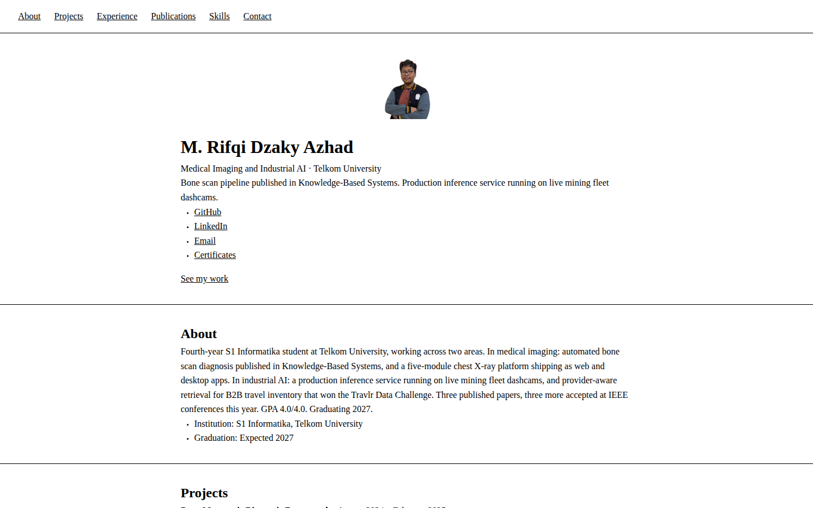
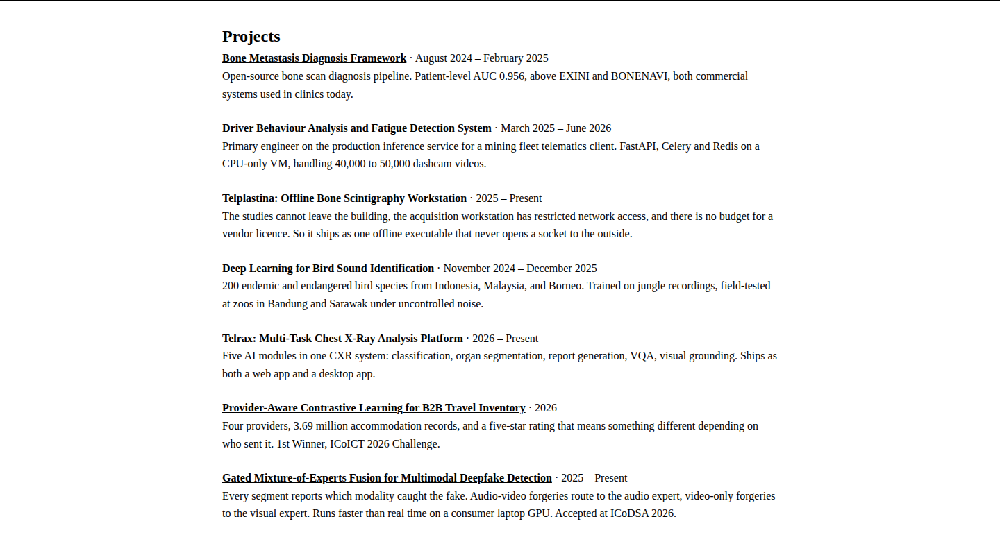

# M. Rifqi Dzaky Azhad

    

Medical Imaging and Industrial AI researcher at Telkom University. This repository hosts the source for my personal portfolio site.

**Live site: [portofolio-app-puce.vercel.app](https://portofolio-app-puce.vercel.app)**

## About

Fourth-year Informatics student at Telkom University, working across medical imaging and industrial AI.

- Automated bone scan diagnosis pipeline published in *Knowledge-Based Systems*, with patient-level AUC 0.956, ahead of the commercial systems EXINI and BONENAVI
- Five-module chest X-ray analysis platform shipping as web and desktop apps
- Production inference service running on live mining fleet dashcams
- Provider-aware retrieval system for B2B travel inventory, 1st Winner at the Travlr Data Challenge
- Three published papers, three more accepted at IEEE conferences
- GPA 4.0/4.0, graduating 2027

## Screenshots

## Find me

| | |
|---|---|
| Portfolio | [portofolio-app-puce.vercel.app](https://portofolio-app-puce.vercel.app) |
| GitHub | [github.com/Liamours](https://github.com/Liamours) |
| LinkedIn | [linkedin.com/in/rifqiazhad0210](https://www.linkedin.com/in/rifqiazhad0210/) |
| Email | [rifqiazhad21@gmail.com](mailto:rifqiazhad21@gmail.com) |
| Certificates | [t.ly/MPcDg](https://t.ly/MPcDg) |

Open to internships and research collaborations in medical imaging, ML engineering, and full-stack deployment.
